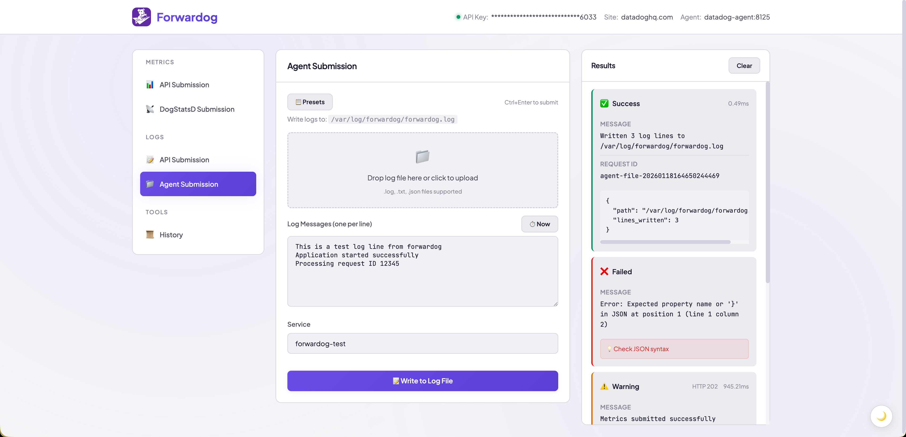

<p align="center">
  
</p>

<h1 align="center">Forwardog</h1>

<p align="center"><strong>Datadog Metrics & Logs Submission Test Tool</strong></p>

Forwardog is a Web UI service that helps you test and validate Datadog metrics and log submission paths. It provides an intuitive interface for sending metrics and logs via various methods.



## Features

### Metrics Submission
- **API-based** - Submit metrics via Datadog Metrics API v2 (`/api/v2/series`)
- **DogStatsD** - Send metrics via UDP to Datadog Agent's DogStatsD

### Logs Submission
- **API-based** - Submit logs via Datadog HTTP intake API
- **Agent File** - Write logs to a file for Datadog Agent collection

### Validation & Automation
- **API Key Validation** - Automatic validation on startup
- **JSON Validation** - JSON syntax checking with formatting support
- **Timestamp Validation** - Warns when timestamps are outside Datadog's acceptable range
- **Presets** - Pre-built templates for common metric types (Gauge, Counter, Distribution) and log formats

## Quick Start

### Prerequisites
- Docker and Docker Compose
- Datadog API Key

### Option 1: Using Pre-built Image (Recommended)

Create a `docker-compose.yml` file:

```yaml
version: "3.8"

services:
  forwardog:
    image: forwardog/forwardog:latest
    container_name: forwardog
    ports:
      - "8000:8000"
    environment:
      - DD_API_KEY=${DD_API_KEY}
      - DD_SITE=${DD_SITE:-datadoghq.com}
      - DD_AGENT_HOST=datadog-agent
      - DOGSTATSD_PORT=8125
    volumes:
      - forwardog-logs:/var/log/forwardog
    networks:
      - forwardog-network
    depends_on:
      - datadog-agent
    restart: unless-stopped

  datadog-agent:
    image: gcr.io/datadoghq/agent:latest
    container_name: datadog-agent
    environment:
      - DD_API_KEY=${DD_API_KEY}
      - DD_SITE=${DD_SITE:-datadoghq.com}
      - DD_DOGSTATSD_NON_LOCAL_TRAFFIC=true
      - DD_LOGS_ENABLED=true
      - DD_LOGS_CONFIG_CONTAINER_COLLECT_ALL=false
      - DD_LOGS_CONFIG_AUTO_MULTI_LINE_DETECTION=true
      - DD_LOGS_CONFIG_FORCE_USE_HTTP=true
      - DD_HOSTNAME=forwardog-agent
    volumes:
      - /var/run/docker.sock:/var/run/docker.sock:ro
      - /proc/:/host/proc/:ro
      - /sys/fs/cgroup/:/host/sys/fs/cgroup:ro
      - forwardog-logs:/var/log/forwardog:ro
    ports:
      - "8125:8125/udp"
    networks:
      - forwardog-network
    restart: unless-stopped

volumes:
  forwardog-logs:
    driver: local

networks:
  forwardog-network:
    driver: bridge
```

Then run:

```bash
export DD_API_KEY=your_api_key_here
docker-compose up -d
```

### Option 2: Build from Source

```bash
git clone https://github.com/forwardog/forwardog.git
cd forwardog

# Copy and edit environment file
cp env.example .env
# Edit .env and add your DD_API_KEY

docker-compose up -d
```

### Access the UI

Open your browser and navigate to: **http://localhost:8000**

## Configuration

### Environment Variables

| Variable | Description | Default |
|----------|-------------|---------|
| `DD_API_KEY` | **Required.** Your Datadog API key | - |
| `DD_SITE` | Datadog site | `datadoghq.com` |
| `DD_AGENT_HOST` | Datadog Agent hostname | `datadog-agent` |
| `DOGSTATSD_PORT` | DogStatsD UDP port | `8125` |
| `MAX_REQUESTS_PER_SECOND` | Rate limit | `10` |
| `MAX_PAYLOAD_SIZE_MB` | Max payload size | `5` |

## API Endpoints

| Endpoint | Method | Description |
|----------|--------|-------------|
| `/` | GET | Web UI |
| `/health` | GET | Health check |
| `/api/config` | GET | Get configuration (masked) |
| `/api/metrics/api/submit` | POST | Submit metrics via form |
| `/api/metrics/api/submit-json` | POST | Submit raw JSON metrics |
| `/api/metrics/dogstatsd/submit` | POST | Send metric via DogStatsD |
| `/api/metrics/dogstatsd/submit-raw` | POST | Send raw DogStatsD line |
| `/api/metrics/presets` | GET | Get metric presets |
| `/api/logs/api/submit` | POST | Submit logs via form |
| `/api/logs/api/submit-json` | POST | Submit raw JSON logs |
| `/api/logs/agent-file/submit` | POST | Write logs to file |
| `/api/logs/presets` | GET | Get log presets |
| `/api/history/` | GET | Get submission history |

## Contributing

Contributions are welcome! Please feel free to submit a Pull Request.
